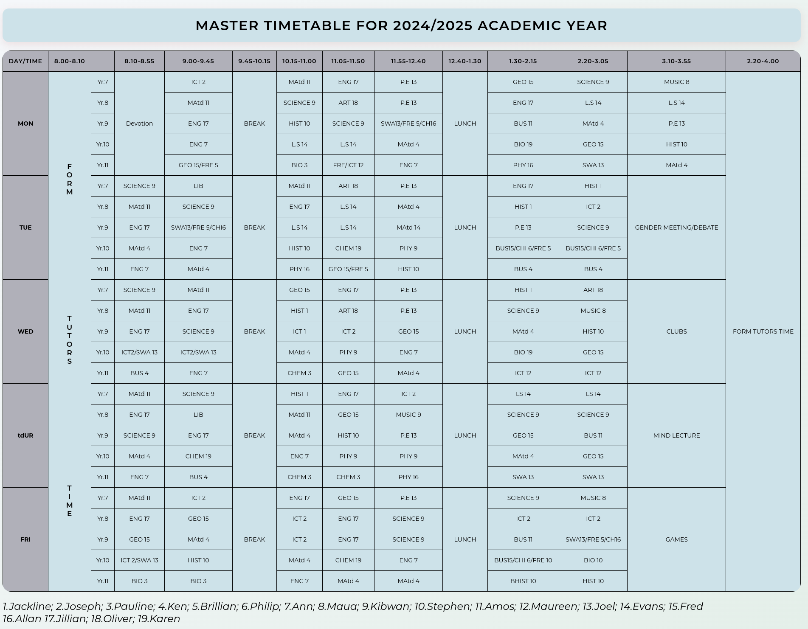

# 2024/2025 Academic Year Timetable Recreation

This project involved developing a web-based representation of an academic timetable, demonstrating proficiency in HTML table structure , CSS styling, and web accessibility guidelines. The timetable displays the schedule for Year 7 to Year 11, Monday to Friday, with detailed time slots, including breaks, lunch, and end-of-day activities.

**Simple Project Description:**

A web-based academic timetable for Year 7-11, demonstrating HTML/CSS and accessibility skills.
 
 

**File Structure:**

├── index.html       # Main HTML file  
├── style.css        # CSS stylesheet  
└── timetablepreview.png 

**How to Access:**

1.  **Access the Timetable:**

    * Once deployed, Vercel will provide a unique URL where you can access the live timetable.

**Author:**

* Name: Michael Ouma

* Phone: 0111932303

* Email: michaelmurukah@gmail.com